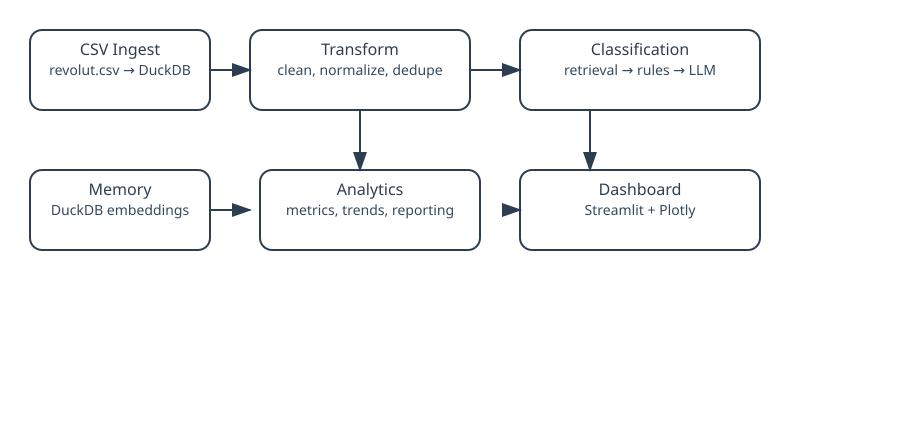
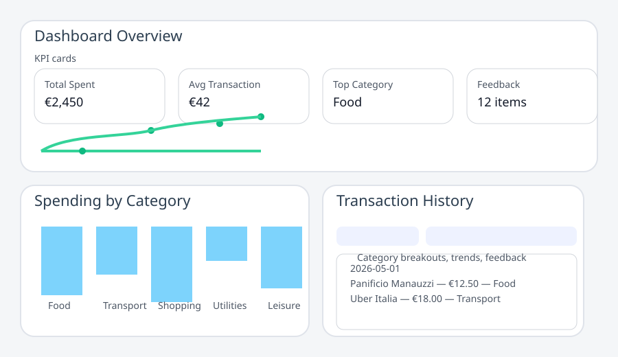

# Expense-Agent: AI-Powered Personal Finance Analysis System

Expense-Agent is an intelligent personal finance management tool that automates expense categorization and provides insightful analytics through a modern web dashboard. Built with a multi-agent AI architecture, it combines rule-based classification, large language models, and user feedback learning to deliver accurate and adaptive expense tracking.

## 🚀 Key Features

- **Automated Expense Categorization**: Retrieval-first classification using semantic memory, rule matching, and selective LLM reasoning
- **Explainability**: Categories are tracked with source metadata and verification notes
- **Interactive Dashboard**: Streamlit-powered web interface with comprehensive visualizations
- **Agent-Based Architecture**: Modular AI agents for classification, insights, and chat interactions
- **Learning System**: User corrections update classification rules for improved accuracy over time
- **Real-Time Analytics**: Monthly trends, category breakdowns, and anomaly detection
- **AI-Powered Insights**: Generate spending insights and chat with an AI assistant about your finances

## 🏗️ Architecture

The system follows a robust ETL pipeline with agent-based processing:


### Core Pipeline
1. **Ingest**: Load and parse CSV transaction data into DuckDB
2. **Transform**: Clean, normalize, and deduplicate transactions
3. **Classify**: Retrieval-first multi-agent classification with memory lookup, rule fallback, and selective LLM reasoning
4. **Analytics**: Generate aggregated metrics and insights

### Agent System
- **RetrievalClassificationAgent**: Semantic memory retrieval for previously labeled transactions
- **RuleClassificationAgent**: Fast keyword matching for high-confidence patterns
- **LLMClassificationAgent**: Selective GPT reasoning when automatic methods are uncertain
- **VerificationAgent**: Conflict detection and confidence calibration across agents
- **FeedbackAgent**: Captures user corrections as memory and future training data
- **InsightAgent**: Generates structured spending analysis
- **ChatAgent**: Provides conversational finance advice

### Data Flow
```
CSV Input → DuckDB → Clean Transactions → Agent Classification → Final Categories → Analytics → Dashboard
```
- **Explainability**: Categories are tracked with source metadata and verification notes
## 🛠️ Technologies Used

- **Backend**: Python, DuckDB (database), Pandas
- **AI/ML**: OpenAI GPT-4o-mini, Semantic retrieval, Embedding memory, Custom agent framework
- **Frontend**: Streamlit, Plotly (visualizations)
- **Infrastructure**: Modular agent architecture, JSON-based rule storage

## 📋 Prerequisites

- Python 3.8+
- OpenAI API Key (for LLM classification)
- DuckDB
- Streamlit

## 🚀 Installation & Setup

1. **Clone the repository**
   ```bash
   git clone https://github.com/Sbord1/Expense-agent.git
   cd Expense-agent
   ```

2. **Create virtual environment**
   ```bash
   python -m venv venv
   source venv/bin/activate  # On Windows: venv\Scripts\activate
   ```

3. **Install dependencies**
   ```bash
   pip install -r requirements.txt
   ```

4. **Set up OpenAI API key**
   ```bash
   export OPENAI_API_KEY="your-api-key-here"
   ```

5. **Prepare data**
   - Place your Revolut CSV export in `data/revolut.csv`
   - Ensure CSV has columns: date, amount, description

## 🎯 Usage

1. **Run the full pipeline**
   ```bash
   python run_pipeline.py
   ```

2. **Launch the dashboard**
   ```bash
   streamlit run app/dashboard.py
   ```

3. **Interact with the system**
   - View categorized expenses by month
   - Generate AI insights
   - Chat with the finance assistant
   - Correct misclassifications to improve future accuracy

## 📊 Dashboard Features

- **KPIs**: Total spent, average transaction, transaction count, top category
- **Monthly Breakdown**: Stacked bar charts with euro values
- **Trend Analysis**: Category-specific spending trends with data labels
- **Transaction Details**: Pie charts and detailed tables per month
- **AI Insights**: Automated spending analysis and recommendations
- **Rule Management**: View and update classification rules



## 🤖 Agent Showcase

- This project demonstrates advanced AI agent patterns:
- **Modular Design**: Each agent has a single responsibility with JSON I/O
- **Retrieval-First Design**: Uses historical transaction memory before resorting to LLMs
- **Confidence-Based Orchestration**: Intelligent fallback between classification methods
- **Verification Layer**: Applies consensus checks to avoid conflicting outputs
- **Learning Loop**: User feedback updates rules and memory to improve accuracy over time
- **Persistence**: Rules stored in JSON and semantic memory stored in DuckDB

## 🔧 Customization

- **Add Categories**: Edit `data/rules.json` to include new expense categories
- **Modify Prompts**: Update agent prompts in `src/agent/` for different behaviors
- **Extend Agents**: Implement new agents inheriting from `src/agent/base.py`

## 📈 Future Enhancements

- Machine learning-based classification using historical data
- Multi-bank CSV support
- Budget tracking and alerts
- Mobile app interface
- Advanced anomaly detection

## 🤝 Contributing

This project showcases modern AI engineering practices including:
- Agent-based system design
- ETL pipeline architecture
- Interactive data visualization
- User feedback integration
- Clean code principles

---

Built with ❤️ using Python, AI agents, and modern data tools.